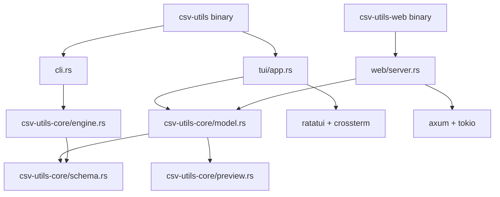

# csv-utils — design & behavior

**Living document.** Update this file whenever you change user-visible behavior, CLI/TUI contracts, data loading, or project layout.

Last verified against: `main` (Rust ratatui TUI + browser web UI, workspace at repo root, June 2025).

---

## Purpose

`csv-utils` is a Rust CSV tool for:

- **CLI:** streaming stats, filters, unique values, and JSON row export on large files.
- **TUI:** interactive table exploration with progressive loading, column sidebar, and mouse/keyboard navigation.

Design goals: fast initial paint, simple CSV parsing (quoted fields via `split_row`), and a shared core library with a local browser UI server.

---

## Architecture



| Layer | Role |
|--------|------|
| `csv-utils/src/main.rs` | Clap CLI dispatch; `tui` subcommand. |
| `csv-utils/src/cli.rs` | CLI command runners. |
| `csv-utils/src/tui/app.rs` | ratatui renderer, event loop, input. |
| `csv-utils-web/src/main.rs` | Browser UI server (`csv-utils-web` binary). |
| `csv-utils-web/src/server.rs` | axum routes, JSON API, embedded HTML. |
| `csv-utils-core/` | CSV parsing, preview buffer, CLI engine, `AppModel`, `ViewAction`, `ClientView`. |

`ClientView` is the JSON snapshot sent to browser clients; `ViewAction` applies keyboard/mouse-style updates shared with the TUI model.

---

## Entry point

```
csv-utils stats <file.csv>
csv-utils unique <file.csv> <col1[,col2,...]> [limit]
csv-utils json <file.csv> [limit]
csv-utils filter <file.csv> <expr> [limit]
csv-utils tui [file.csv]
```

- **`tui`:** full-screen TUI; optional CSV path (empty usage hint if omitted).
- **Other commands:** see [CLI commands](#cli-commands).

Build: `pixi run build` or `cargo build --release`. Binary: `target/release/csv-utils`.

Pixi tasks run from the **repo root**; extra args are forwarded (`pixi run tui file.csv`, `pixi run run -- stats file.csv`).

---

## CLI commands

| Command | Usage | Default limit | Behavior |
|---------|--------|---------------|----------|
| `stats` | `stats <file.csv>` | — | Per-column row/null/non-null counts and `max_width`. |
| `unique` | `unique <file> <col1[,col2,...]> [limit]` | 50 | Distinct value combinations as JSON objects. |
| `json` | `json <file> [limit]` | 20 | Rows as JSON objects. |
| `filter` | `filter <file> <expr> [limit]` | 50 | Matching rows as JSON objects. |

**Filter expression** (`csv-utils-core/predicate.rs`):

- Operators: `=`, `!=`, `>`, `<`, `contains`, `in`
- Examples: `city=Tehran`, `age>30`, `name contains Ali`, `city in Tehran\|Paris`
- Comma-separated AND between conditions.

CLI reads the file sequentially and calls `split_row` on every data line — heavier than TUI preview, which keeps raw lines until render.

Implementation: `csv-utils-core/src/engine.rs`.

---

## TUI

### Stack

- **ratatui** 0.29 + **crossterm** (alternate screen, mouse capture).
- **Frontend:** `csv-utils/src/tui/app.rs`
- **State:** `AppModel` + `TableViewState` in `csv-utils-core/src/model.rs`
- **Data table:** ratatui `Table`
- **Column sidebar:** manual `Paragraph` list (not ratatui `List`; see [Column list scrolling](#column-list-scrolling))

### Screen layout

```
┌─ csv-utils │ file.csv │ N rows [loading…] ─────────────────────┐
│ ┌─ Data (rows A–B) ─────────────┐ ┌─ Columns (X–Y/Z) ────────┐ │
│ │ header + visible rows         │ │ idx: name [type]         │ │
│ │ 18-char cells, col scroll     │ │ independent list scroll  │ │
│ └───────────────────────────────┘ └──────────────────────────┘ │
│ q quit  ↑↓ rows  ←→ cols  t types  ? help                       │
└─────────────────────────────────────────────────────────────────┘
```

| Region | Description |
|--------|-------------|
| **Title** | File basename, live row count, `loading…` or `ERROR`. |
| **Data table** | Horizontal window (`col_offset`) + vertical window (`row_offset`). Selected cell yellow; selected row dimmed. |
| **Columns pane** | 32-char wide; title `Columns (X–Y/Z)`; selected line `▸` + magenta. |
| **Help** | Centered overlay; `?` opens; `Esc` / `?` closes. |

### View state

`TableViewState` (`model.rs`):

| Field | Role |
|-------|------|
| `selected_row`, `selected_col` | Active cell (0-based). Row max = loaded body lines − 1. |
| `row_offset` | First body row in table viewport. |
| `col_offset` | First column in table viewport. |
| `column_list_offset` | First column shown in sidebar (independent of selection). |
| `show_column_types` | Sidebar `[type]` suffix when true. |
| `show_help` | Help overlay visible. |

`CELL_DISPLAY_WIDTH = 18`; horizontal capacity ≈ `table_width / 19` columns.

Each frame: `clamp_selection(viewport_rows, table_width)` and `clamp_column_list_offset(visible_height)`.

### Data loading

1. **Sync:** header + first **128** body lines as raw UTF-8 (`INITIAL_BODY_LINES`).
2. **Background thread:** append remaining body lines to `PreviewData`.
3. **Render:** `split_row` only on visible rows.

Headers are available immediately. Row count in the title grows until `scan_done`.

| API | Use |
|-----|-----|
| `PreviewData::load_header_and_initial_rows` | TUI startup |
| `PreviewData::start_background_scan` | Background append |
| `PreviewData::load_limited` | Tests (`scan_done = true`) |

I/O: 1 MiB `BufReader`, `\n`-delimited lines. Run from repo root for `test-data/…` paths.

### Column types (display only)

Inferred from header name prefixes (matches test data generator):

| Prefix | Kind | Alignment |
|--------|------|-----------|
| `str_` | string | left |
| `long_str_` | long string | left |
| `float_general_` | float | right |
| `float_scientific_` | float (sci) | right |
| `float_mixed_` | float (mixed) | right |
| `int_` | integer | right |
| `date_` | date | left |
| (other) | unknown | left |

Non-printable bytes → `.`; truncation → `~` (`format_cell`).

### Keyboard

| Key | Action |
|-----|--------|
| `q` | Quit |
| `↑`/`↓` or `j`/`k` | Previous / next row |
| `←`/`→` or `h`/`l` | Previous / next column |
| `PgUp`/`PgDn` | Move selection ±10 rows |
| `Home`/`End` | First / last loaded row |
| `t` | Toggle type labels in column list |
| `?` | Help overlay |
| `Esc` | Close help |

### Mouse

| Target | Action |
|--------|--------|
| Table header | Select column only |
| Table body cell | Select row + column |
| Table wheel | Move `selected_row` ±3 |
| Column list click | Select column |
| Column list wheel | Scroll sidebar ±3 via `column_list_offset` |

Table hit-testing: `hit_test_table` in `app.rs` (block inner rect, 18+1 char columns).

### Column list scrolling

Sidebar uses manual lines + `column_list_offset`. ratatui `List` was avoided because it resets offset each frame to keep the selected item visible, which blocked wheel scrolling past the current selection.

- Scroll max: `headers.len() − visible_height` (header count, not row count).
- Wheel updates offset only.
- Selection changes call `ensure_column_list_shows_selection`.

---

## Web UI (browser)

Binary: **`csv-utils-web`** (`target/release/csv-utils-web`).

```
csv-utils-web [file.csv] [--host HOST] [--port PORT]
```

| Flag | Default | Meaning |
|------|---------|---------|
| `--host` | `127.0.0.1` | Bind address (use `0.0.0.0` for LAN access). |
| `--port` | `8080` | TCP port. |

Opens the same `AppModel` as the TUI. Serves embedded HTML at `/` and a JSON API:

| Route | Method | Purpose |
|-------|--------|---------|
| `/` | GET | Single-page browser UI (table + column sidebar). |
| `/api/state` | GET | Current `ClientView` JSON. |
| `/api/action` | POST | Apply a `ViewAction` (`{"action":"row_delta","value":-1}`, etc.). |

The page polls `/api/state` while the background scan runs. Keyboard bindings mirror the TUI (`↑↓←→`, `PgUp`/`PgDn`, `Home`/`End`, `t`, `?`, `Esc`). Mouse: click cells/columns; wheel scrolls rows or column list.

**Theme:** follows the OS light/dark preference by default (`prefers-color-scheme`). Header **Theme** button cycles **System → Light → Dark**; choice is stored in `localStorage` (`csv-utils-theme`) and overrides system until set back to System.

Layout constants match the TUI defaults: 24 visible rows, 110-char table width, 20 sidebar lines.

Pixi:

```bash
pixi run web -- test-data/generated/test_1000x100.csv
pixi run web -- --host 0.0.0.0 --port 8080 file.csv
pixi run web-tui   # shortcut with test CSV
```

Then open `http://127.0.0.1:8080/` (or your `--host`/`--port`). Ctrl+C stops the server and joins the background scan thread.

---

## Core: CSV parsing

`schema::split_row` — quoted fields, `""` escape, comma split outside quotes.

---

## Test data generation

Script: `scripts/generate_test_data.py`  
Task: `pixi run gen-test-data`

| Key | Rows | Cols | Output |
|-----|------|------|--------|
| `1000x100` | 1,000 | 100 | `test-data/generated/test_1000x100.csv` |
| `10000x1000` | 10,000 | 1,000 | `test-data/generated/test_10000x1000.csv` |

See `docs/test-data-generation.md`.

---

## Build & development tasks

| Task | Command |
|------|---------|
| Build | `pixi run build` |
| Run CLI | `pixi run run -- stats file.csv` |
| TUI | `pixi run tui file.csv` |
| Web UI | `pixi run web -- file.csv` or `pixi run web-tui` |
| Unit tests | `pixi run test` |
| Generate test CSVs | `pixi run gen-test-data` |
| TUI snapshot | `pixi run test-tui-large-capture` → `artifacts/tui_snapshot_large.txt` |

**Dependencies:** ratatui, crossterm, clap, anyhow, thiserror, axum, tokio, serde (`Cargo.toml` workspace).

---

## Module map

```
Cargo.toml                   # workspace root
csv-utils-core/
  src/
    lib.rs
    schema.rs
    predicate.rs
    preview.rs
    stats.rs
    unique.rs
    json_view.rs
    engine.rs
    column.rs
    model.rs
    actions.rs
    client_view.rs
csv-utils/
  src/
    main.rs
    cli.rs
    tui/
      mod.rs
      app.rs
csv-utils-web/
  src/
    main.rs
    server.rs
    assets.rs
    index.html
scripts/
  generate_test_data.py
  capture_tui_snapshot.py
test-data/generated/
docs/
```

---

## Known limitations

- TUI holds all body lines in memory as raw strings (not suitable for multi-GB files without paging).
- Column types are name-prefix heuristics, not value inference.
- CLI commands re-open files; no shared cache with TUI.
- Fixed 18-char table columns; no column/sidebar resize in TUI.
- Row navigation limited to loaded lines until background scan completes.
- JSON CLI output does not escape embedded quotes in values.

---

## Related docs

| Document | Contents |
|----------|----------|
| `docs/test-data-generation.md` | Generator usage and column mix. |
| `README.md` | Quick start and pixi tasks. |

When behavior changes, update **this file first**, then `README.md`.
