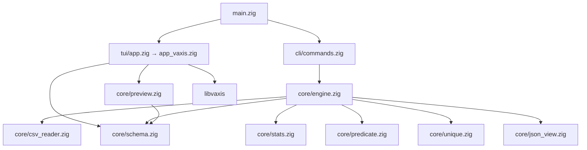

# csv-utils — design & behavior

**Living document.** Update this file whenever you change user-visible behavior, CLI/TUI contracts, data loading, or project layout. It should reflect what the code does today, not future plans.

Last verified against: `main` (libvaxis TUI, Zig 0.16, per-column resize).

---

## Purpose

`csv-utils` is a Zig CSV tool for:

- **CLI:** streaming stats, filters, unique values, and JSON row export on large files.
- **TUI:** interactive table exploration with progressive loading, column sidebar, and mouse/keyboard navigation.

Design goals: bounded memory for preview/TUI, fast initial paint, and simple CSV parsing (quoted fields via `schema.splitRow`).

---

## High-level architecture



| Layer | Role |
|--------|------|
| `main.zig` | Dispatches `tui` or delegates to CLI commands. |
| `cli/` | Argument parsing and command routing. |
| `core/` | CSV I/O, parsing, queries, preview buffer. |
| `tui/` | Terminal UI (`libvaxis`), rendering, input. |
| `scripts/` | Test data generation and TUI snapshot capture. |

---

## Entry point & modes

```
csv-utils <command> [args...]
csv-utils tui [file.csv]
```

- **`tui`:** Opens full-screen TUI. Optional CSV path; without a file, shows an empty table.
- **Other commands:** `stats`, `unique`, `json`, `filter` — see [CLI commands](#cli-commands).

Implementation: `src/main.zig`.

---

## CLI commands

| Command | Usage | Behavior |
|---------|--------|----------|
| `stats` | `stats <file.csv>` | One pass: per-column null/non-null counts and numeric min/max/mean where parseable. |
| `unique` | `unique <file> <col1[,col2,...]> [limit]` | Distinct values per column (default limit 50). |
| `json` | `json <file> [limit]` | Print rows as JSON objects (default limit 20). |
| `filter` | `filter <file> <expr> [limit]` | Rows matching expression (default limit 50). |

**Filter expression** (`core/predicate.zig`):

- Operators: `=`, `!=`, `>`, `<`, `contains`, `in`
- Examples: `city=Tehran`, `age>30`, `name contains Ali`, `city in Tehran\|Paris`
- Comma-separated AND for simple `col=val` forms.

CLI reads the file **sequentially** and calls `splitRow` on every data line — heavier than TUI preview, which keeps raw lines until render.

Implementation: `src/cli/commands.zig`, `src/core/engine.zig`.

---

## TUI

### Stack

- **Terminal library:** [libvaxis](https://github.com/rockorager/libvaxis) (Zig package in `build.zig.zon`).
- **Shim:** `src/tui/app.zig` re-exports `app_vaxis.zig`.
- **Zig:** 0.16 (`std.Io`, `std.process.Init`, `std.atomic.Mutex`).

Terminal setup: alternate screen, mouse reporting enabled, conservative ASCII rendering (charset reset, no `queryTerminal` negotiation).

### Screen layout

```
 Row 0: title — "csv-utils TUI (libvaxis)"
 Row 1: status — file=… rows=… cell=[rN,cM]
 Row 2: horizontal rule
 Row 3: table header row
 Row 4+: data rows (">" marks selected row)
 Last row: horizontal rule
 Right: column sidebar (variable width)
 Between table and sidebar: "<>" resize handle + sidebar splitter
```

| Region | Description |
|--------|-------------|
| **Row marker** | 2 columns; `>` on selected row. |
| **Table** | Variable-width columns; each column is `(width - 1)` content + `\|` separator. |
| **Sidebar** | Column index + name; optional type suffix when toggled. |
| **Sidebar splitter** | Column immediately left of sidebar; drag to resize sidebar. |

### Data loading (TUI)

1. **Sync:** `loadPreviewHeaderAndInitialRows(path, 128)` — header + first 128 body lines as **raw UTF-8** (not split into fields yet).
2. **Background thread:** `streamAppendBodyLinesAfterSkip` — skips header + already-loaded lines, appends remaining lines to `PreviewData.rows`.
3. **Render:** Each visible frame parses only displayed rows with `schema.splitRow` (arena allocator, freed each frame).

`PreviewData` (`core/preview.zig`) is mutex-protected; row count grows while `scan_done` is false. Status line shows current `rows=`.

### Column types (display only)

Inferred from **header name prefixes** (matches generated test data):

| Prefix | Kind | Cell alignment |
|--------|------|----------------|
| `str_` | string | left |
| `long_str_` | long string | left |
| `float_general_` | float | right |
| `float_scientific_` | float (sci) | right |
| `float_mixed_` | float (mixed text) | right |
| `int_` | integer | right |
| `date_` | date | left |
| (other) | unknown | left |

Non-printable bytes in cells are shown as `.`; overflow uses `~` in the last column.

### Keyboard

| Key | Action |
|-----|--------|
| `q` | Quit |
| `↑` / `↓` | Previous / next row |
| `←` / `→` | Previous / next **column** (moves selection and table horizontal scroll) |
| `t` | Toggle type labels in sidebar (`Columns (t)` + `[type]` suffix) |

### Mouse

| Target | Action |
|--------|--------|
| Table cell (not on `\|`) | Select row + column |
| Header cell | Select column only |
| Column boundary (`\|`) | Drag to resize **column to the left** (width 6–64, default 16) |
| Sidebar list item | Select column |
| Sidebar + wheel | Scroll column list (`sidebar_col_offset`, independent of `←`/`→`) |
| Table + wheel | Scroll selection by 3 rows |
| `<>` / sidebar splitter | Drag to resize sidebar (width 18–60, default 28) |

Column widths are stored per session in `column_widths` (one `i32` per header). Horizontal scroll (`col_offset`) keeps the selected column visible based on cumulative widths.

### Rendering notes

- Per-frame `ArenaAllocator` holds all formatted cell buffers until `vx.render()` completes (avoids use-after-free in libvaxis).
- Selected cell uses reverse video; active resize targets use bold/reverse on separators.

Implementation: `src/tui/app_vaxis.zig`.

---

## Core: CSV preview

| API | Use |
|-----|-----|
| `loadPreviewHeaderOnly` | Header only; body streamed later. |
| `loadPreviewHeaderAndInitialRows` | TUI startup. |
| `loadPreviewLimited` | Benchmark/tests; full read up to limit, `scan_done = true`. |
| `streamAppendBodyLinesAfterSkip` | Background append after initial rows. |

I/O: 1 MiB read buffer, line-based `takeDelimiter('\n')`, `std.Io.Dir.cwd().openFile`.

---

## Core: CSV parsing

`schema.splitRow` — splits one line into fields with quoted-field support. Used by CLI engine and TUI per-row render.

`csv_reader.zig` — iterator-style line reader for CLI streaming.

---

## Test data generation

Script: `scripts/generate_test_data.py`  
Task: `pixi run gen-test-data`

**Datasets (configured):**

| Key | Rows | Cols | Output |
|-----|------|------|--------|
| `1000x100` | 1,000 | 100 | `test-data/generated/test_1000x100.csv` |
| `10000x1000` | 10,000 | 1,000 | `test-data/generated/test_10000x1000.csv` |

**Column order in file:** First seven columns are one of each type (`str_000`, `long_str_000`, `float_general_000`, …), then remaining columns per layout ratios.

See also: `docs/test-data-generation.md` (run instructions; verify dataset list against `SPECS` in the script).

---

## Build & development tasks

| Task | Command |
|------|---------|
| Build | `pixi run build` |
| Run CLI | `pixi run run -- <cmd> …` |
| TUI | `pixi run tui [file]` |
| Unit tests | `pixi run test` |
| Preview benchmark | `pixi run bench-parse [-- file limit]` |
| Generate test CSVs | `pixi run gen-test-data` |
| TUI snapshot (CI/debug) | `pixi run test-tui-large-capture` → `artifacts/tui_snapshot_large.txt` |
| Debug first row parse | `pixi run debug-preview-large` |

**Binaries** (`zig-out/bin/`): `csv-utils`, `bench-csv-parse`, `debug-preview-dump`.

**Dependencies:** `libvaxis` pinned in `build.zig.zon`; Zig `>=0.16,<0.17`.

---

## Debugging & artifacts

- **`scripts/capture_tui_snapshot.py`** — Runs built binary in PTY via `script(1)`, writes ANSI snapshot + report. Default command: `./zig-out/bin/csv-utils tui "{file}"`.
- **`artifacts/`** — Snapshot outputs (gitignored as needed; see `.gitignore`).

---

## Module map (current)

```
src/
  main.zig
  bench_csv_parse_main.zig
  debug_preview_dump.zig
  cli/
    args.zig
    commands.zig
  core/
    preview.zig      # TUI buffer + streaming
    schema.zig       # splitRow, column index
    csv_reader.zig
    engine.zig       # CLI commands
    predicate.zig
    stats.zig
    unique.zig
    json_view.zig
  tui/
    app.zig          # export run
    app_vaxis.zig    # TUI implementation
  cache/
    index_store.zig  # stub / future cache
```

---

## Known limitations

- TUI stores **all** body lines in memory as raw strings (grows with file size; fine for test files, not for multi-GB without future paging).
- Column types are **name-based heuristics**, not schema inference from values.
- Filter/stats CLI do not share the TUI preview buffer; each command re-opens the file.
- `cache/index_store.zig` is not wired into the hot path yet.

---

## Related docs

| Document | Contents |
|----------|----------|
| `docs/implementation-plan.md` | Original project plan (historical; ncurses-era structure). |
| `docs/test-data-generation.md` | Generator usage and column mix. |
| `README.md` | Quick start and command examples. |

When behavior changes, update **this file first**, then adjust README/examples if user-facing commands changed.
