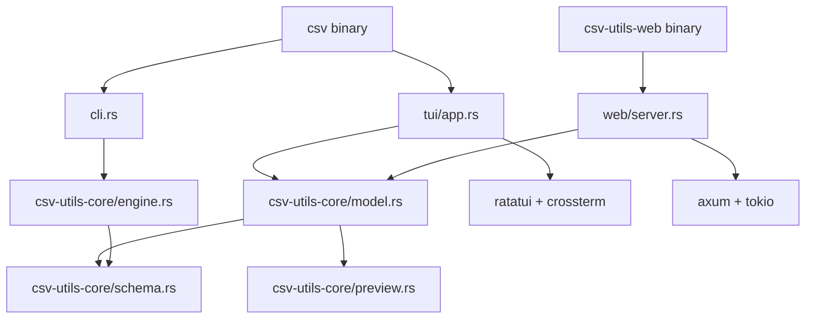

# Architecture

Runtime structure of csv-utils: binaries, shared core, and the view model used by TUI and web frontends.

## System overview



| Layer | Role |
|--------|------|
| `csv-utils/src/main.rs` | Clap CLI dispatch; `tui` subcommand |
| `csv-utils/src/cli.rs` | CLI command runners |
| `csv-utils/src/tui/app.rs` | ratatui renderer, event loop, input |
| `csv-utils-web/src/main.rs` | Browser UI server entry |
| `csv-utils-web/src/server.rs` | axum routes, JSON API, embedded HTML |
| `csv-utils-core/` | Parsing, preview, CLI engine, `AppModel`, actions, client view |

## Workspace layout

```
Cargo.toml                   # workspace root
csv-utils-core/              # shared library
csv-utils/                   # CLI + TUI binary
csv-utils-web/               # browser server binary
recipe/recipe.yaml           # conda package (rattler-build)
scripts/                     # test data + TUI capture
test-data/generated/
docs/
```

## Shared view model

Interactive UIs do not duplicate CSV state. They use:

| Type | Location | Role |
|------|----------|------|
| `AppModel` | `model.rs` | File path, `PreviewData`, `TableViewState`, merged settings, scan thread |
| `TableViewState` | `model.rs` | Selection, scroll offsets, column widths, UI flags, filter state, row-filter cache |
| `ViewAction` | `actions.rs` | Keyboard/mouse-style mutations (row/col delta, resize, etc.) |
| `ViewLayout` | `actions.rs` | Viewport dimensions for clamping (rows, table width, sidebar height) |
| `ClientView` | `client_view.rs` | JSON snapshot for browser clients |
| `ViewSnapshot` | `model.rs` | Richer in-memory snapshot (future/alternate clients) |

Flow:

1. **Input** → TUI event loop or web `POST /api/action` parses intent.
2. **`apply_action`** → mutates `TableViewState`, runs `tick()` (clamp selection/scroll).
3. **Render** → TUI draws from `AppModel`; web returns `ClientView` JSON.

### Row-filter cache

`TableViewState` holds `cached_matching_rows: Option<Vec<usize>>` and `cached_row_count: usize`.
`AppModel::matching_row_indices(&mut self) -> &[usize]` returns the cache, rebuilding it only when the loaded row count changes or a filter is mutated. Draw code uses the read-only `cached_matching_rows(&self) -> Option<&[usize]>` accessor. `maybe_update_column_layout()` (called once per event-loop tick) warms the cache before any draw. This limits the row-filter scan to **at most one pass per tick**, regardless of how many places in the render pipeline need the filtered row list. See [Row filtering design](design/row-filtering.md).

## CLI vs interactive loading

| Path | Reads file | Parses rows |
|------|------------|-------------|
| CLI (`engine.rs`) | Sequential stream | Every data line via `schema::split_row` |
| TUI / web (`preview.rs`) | mmap + offset index | `csv` on demand for visible rows; background indexes all records |

CLI commands re-open files; there is no shared cache with TUI/web sessions.

## Module map

```
csv-utils-core/src/
  lib.rs
  schema.rs               # split_row, read_fields_from_slice (csv crate)
  predicate.rs            # CLI filter expressions
  preview.rs              # PreviewData, mmap, offset index, background scan
  column_layout.rs        # ColumnLayoutState (width, inference, stats)
  stats.rs
  unique.rs
  json_view.rs
  engine.rs               # CLI orchestration
  column.rs               # ColumnKind, value-based type inference
  display.rs              # truncate_middle, numeric rescaling, format_cell_for_column
  model.rs                # AppModel, TableViewState, row-filter cache, auto-fit
  settings.rs             # layered global + local csv-utils.json load/merge
  actions.rs              # ViewAction, apply_action
  client_view.rs          # ClientView JSON
  fuzzy.rs                # fuzzy_score (subsequence), rank_by_fuzzy
  column_value_filter.rs  # numeric expression parser + fuzzy text row filter eval

csv-utils/src/
  main.rs
  cli.rs
  tui/app.rs
  tui/column_finder.rs    # ColumnFinderState: / fuzzy column search bar

csv-utils-web/src/
  main.rs
  server.rs
  assets.rs
  index.html
```

## Related docs

- [Data loading](reference/data-loading.md) — preview APIs and threading
- [CSV parsing](reference/csv-parsing.md) — `csv` crate parsing and display rules
- [Settings config](design/settings-config.md) — global home config + local overrides
- [Build & packaging](development/build.md) — pixi tasks and conda recipe
