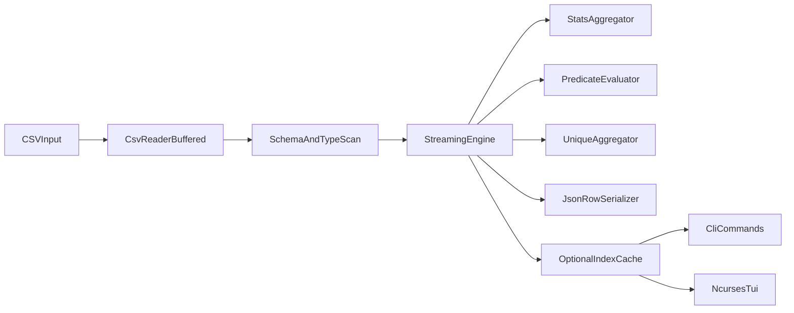

# Zig CSV Utility Plan

## Objectives
- Deliver a fast Zig-based CSV analyzer supporting both CLI and interactive TUI.
- Optimize for multi-GB files via streaming execution and bounded memory usage.
- Meet MVP feature set: column statistics, multi-column filtering, unique values, and row-to-JSON view.

## Proposed Project Structure
- [`src/main.zig`](/home/amirhossein/csv-utils/src/main.zig): app entrypoint and mode dispatch (`cli` vs `tui`).
- [`src/cli/args.zig`](/home/amirhossein/csv-utils/src/cli/args.zig): command parsing and validation.
- [`src/cli/commands.zig`](/home/amirhossein/csv-utils/src/cli/commands.zig): command implementations (`stats`, `filter`, `unique`, `json`).
- [`src/core/csv_reader.zig`](/home/amirhossein/csv-utils/src/core/csv_reader.zig): buffered CSV parser with quoted-field support.
- [`src/core/schema.zig`](/home/amirhossein/csv-utils/src/core/schema.zig): header handling, column lookup, type inference helpers.
- [`src/core/engine.zig`](/home/amirhossein/csv-utils/src/core/engine.zig): streaming query execution pipeline.
- [`src/core/predicate.zig`](/home/amirhossein/csv-utils/src/core/predicate.zig): single/multi-column filter expression evaluation.
- [`src/core/stats.zig`](/home/amirhossein/csv-utils/src/core/stats.zig): numeric/categorical stats aggregators.
- [`src/core/unique.zig`](/home/amirhossein/csv-utils/src/core/unique.zig): distinct extraction with caps/spill strategy.
- [`src/core/json_view.zig`](/home/amirhossein/csv-utils/src/core/json_view.zig): row projection and JSON serialization.
- [`src/cache/index_store.zig`](/home/amirhossein/csv-utils/src/cache/index_store.zig): optional persisted metadata/index cache.
- [`src/tui/app.zig`](/home/amirhossein/csv-utils/src/tui/app.zig): ncurses app lifecycle.
- [`src/tui/views/*.zig`](/home/amirhossein/csv-utils/src/tui/views/*.zig): panes for stats, filters, unique values, row JSON.
- [`build.zig`](/home/amirhossein/csv-utils/build.zig): build targets, dependency wiring, optimization profile.
- [`README.md`](/home/amirhossein/csv-utils/README.md): usage, feature matrix, performance notes.

## Architecture

## Execution Model
- **Streaming-first core**: line-by-line processing with fixed-size buffers and zero-copy slices where possible.
- **Hybrid acceleration**: optional cache/index artifacts keyed by file fingerprint (size + mtime + header hash) to speed repeated queries.
- **Memory safety/perf**: avoid loading full files; use bounded hash maps for uniques and configurable caps.

## Feature Delivery Phases
1. **Foundation + CLI MVP**
   - Implement CSV reader, schema/header handling, and command parser.
   - Add CLI commands:
     - `stats`: per-column count/nulls/min/max/mean and top-k categorical counts.
     - `filter`: predicates on one or multiple columns with operators (`=`, `!=`, `>`, `<`, `contains`, `in`).
     - `unique`: distinct values for one or multiple columns with row limit.
     - `json`: emit selected rows as JSON objects.
2. **Performance and Hybrid Cache**
   - Add optional cache files for inferred schema, sampled cardinality, and reusable column metadata.
   - Add chunked execution and benchmark harness for multi-GB files.
3. **TUI (ncurses)**
   - Implement pane-based UI:
     - file summary + schema panel
     - stats panel
     - filter builder panel (multi-column predicates)
     - unique values panel
     - row preview panel (JSON rendering)
   - Wire all interactions to the same core engine to avoid logic duplication.
4. **Hardening**
   - Add large-file regression tests, malformed CSV handling, and edge-case quoting tests.
   - Improve docs and example workflows.

## Performance Strategy
- Use buffered IO and avoid per-cell heap allocations.
- Reuse arenas/pools per chunk, reset between chunks.
- Provide tunables (`--buffer-size`, `--chunk-rows`, `--top-k`, `--unique-cap`).
- Support early termination for filtered scans and limited outputs.
- Expose benchmark command for reproducible throughput metrics.
